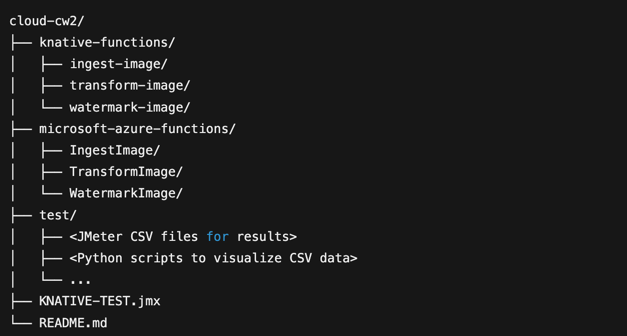

Cloud Computing Coursework 2: Serverless Computing

Overview

This repository contains the implementation for the COMP5123M Cloud Computing Systems coursework on serverless computing. The objective of this coursework is to explore and evaluate serverless computing using a commercial platform (Microsoft Azure Functions) and an open-source platform (Knative), using Python as the runtime environment.

Selected Platforms and Runtime

Commercial Serverless Platform: Microsoft Azure Functions

Open Source Serverless Platform: Knative

Programming Language: Python 3.9

Docker images for Knative: https://hub.docker.com/repositories/qhzd4479

Application Description

A multi-step image-processing pipeline was implemented consisting of three sequential serverless functions:

Ingest Image: Receives an image uploaded via an HTTP request and forwards it to the Transform Image function.

Transform Image: Converts the uploaded image to grayscale and sends it to the Watermark Image function.

Watermark Image: Adds a predefined watermark text to the processed grayscale image and returns the final result.

This pipeline demonstrates a real-world scenario of using serverless architecture for media processing tasks.

Repository Structure

Experiments and Evaluation

The project involves:

Deploying identical workflows on both platforms.

Performing load tests and scalability assessments by increasing concurrent invocations.

Evaluating performance in terms of response time, scalability, and ease of deployment.

Results are documented with comprehensive data and comparisons between Azure Functions and Knative to provide insights into their operational efficiencies and suitability.

Code and Scripts

Code implementations for both serverless platforms are provided clearly in separate directories. All scripts required for deploying and testing these functions are included within their respective directories.

Testing Methodology:
JMeter is used to test cold start (single request after idle) and warm start under load (concurrent requests).
Aggregate and summary reports are generated in CSV format and stored under test/.
Python scripts in test/ parse these CSVs to visualize and compare performance metrics (e.g., response time percentiles).

This coursework repository is for academic purposes related to COMP5123M. For queries or feedback, please raise issues within this repository.

© University of Leeds – COMP5123M Cloud Computing Systems Coursework 2.
